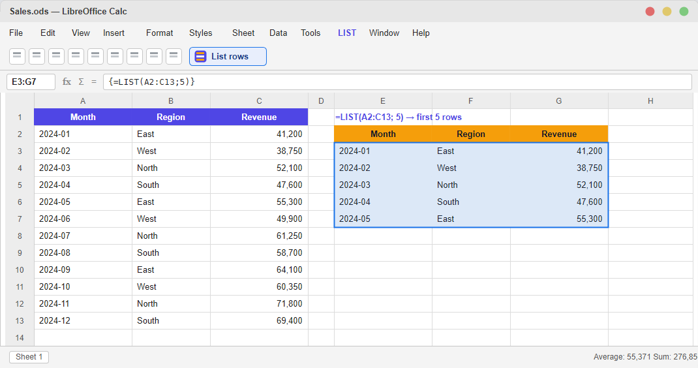
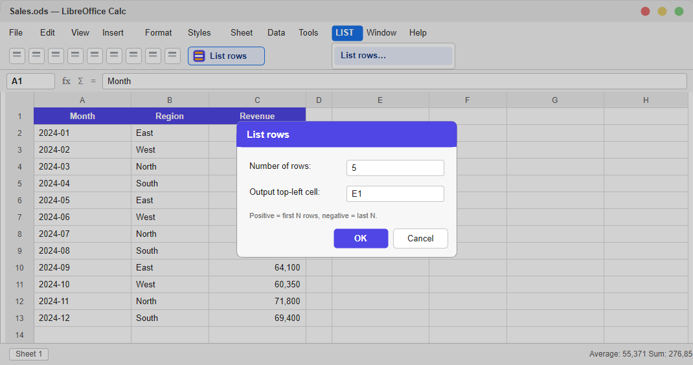

# calc_list_first_last


A LibreOffice Calc extension that returns the first or last *N* rows of a
range. It offers **two** ways to do this, because LibreOffice functions cannot
"spill" a result across cells the way Excel 365 does:

1. **`LIST` worksheet function** — a live array formula.
2. **`LIST` &rsaquo; `List rows...` menu / toolbar command** — a macro that
   *writes* the rows into the sheet (the practical "spill").

In both, the count is signed:

* `count > 0` &rarr; the **first** `count` rows
* `count < 0` &rarr; the **last** `|count|` rows

## 1. The `LIST` function

```
=LIST(range; count; include_header)
```

`include_header` is **optional** (default `0`). Set it to `1` to always return
the range's first row as a header row; `count` then selects from the data rows
below it. (`TRUE()`/`FALSE()` work too, but `1`/`0` are simpler.)

LibreOffice does not auto-spill, so enter `LIST` as an **array formula**:
select the output block (rows &times; columns), type the formula, and press
**Ctrl+Shift+Enter**.

| Select | Formula (Ctrl+Shift+Enter) | Returns |
| --- | --- | --- |
| a 5&times;3 block | `=LIST(A1:C100; 5)`  | first 5 rows |
| a 5&times;3 block | `=LIST(A1:C100; -5)` | last 5 rows |
| a 6&times;3 block | `=LIST(A1:C100; -5; 1)` | header row + last 5 data rows |

Remember the output block must include room for the header row when
`include_header` is `1` (e.g. select 6 rows for a header + 5 data rows).

`LIST` appears in the Function Wizard under the **Add-In** category.

### Range syntax

The `range` argument follows normal LibreOffice Calc rules — **not** Google
Sheets rules. In particular, open-ended references like `A2:C` are **invalid**
in Calc (they return `#NAME?`).

| Range | Valid? | Meaning |
| --- | :---: | --- |
| `A2:C13`        | ✅ | bounded — rows 2 to 13 |
| `A2:C1000`      | ✅ | bounded with headroom — **recommended** |
| `A2:C1048576`   | ✅ | row 2 to the last row (1048576 = Calc's max) |
| `A:C`           | ✅ | whole columns A–C (**includes** the header row 1) |
| `A2:C`          | ❌ | open-ended range — **not supported**, gives `#NAME?` |

Prefer a **bounded** range such as `A2:C1000`. Whole-column (`A:C`) and
max-row (`…:C1048576`) references work but hand the function a ~1,000,000-row
matrix on every recalc, which is slow. If you would rather not specify the last
row at all, use the **List rows** command below — it auto-detects the data
block for you.

## 2. The "List rows" command

Menu **LIST &rsaquo; List rows...** (also a toolbar button). Click a cell
inside your data first; the command auto-detects the contiguous data block,
asks for a row count and an output cell — with an **Include header row**
checkbox — then writes the rows there. Re-run it to refresh. This has no
whole-column penalty and needs no Ctrl+Shift+Enter.

## Screenshots

**The `LIST` function** — a `Ctrl+Shift+Enter` array formula returning the first
5 rows:



**The "List rows" command** — menu/toolbar action that writes the rows into the
sheet:



> The screenshots are rendered UI illustrations of the extension (produced from
> `assets/screenshot-*.svg`). Logos live in `assets/logo-*.svg` / `.png`.

## Project layout

```
idl/com/example/list/XList.idl   UNO interface for the add-in function
src/list_impl.py                 Python component implementing the LIST function
src/list_rows.py                 Python macro behind the "List rows" command
registration/CalcAddIns.xcu      Registers LIST with Calc (names, help, category)
registration/Addons.xcu          Registers the LIST menu + toolbar button
registration/manifest.xml        Package manifest (-> META-INF/manifest.xml)
registration/description.xml     Extension metadata
build.ps1                        Compiles the IDL and packages build/LIST.oxt
tools/test_list.py               End-to-end test of the LIST function
tools/test_macro.py              End-to-end test of the "List rows" command
```

### Two packaging gotchas (both fixed here)

* The IDL file must live at a path matching its module (`com/example/list/`).
  `unoidl-write`'s source-tree reader derives the UNO module name from the
  **directory structure**, not from the `module { }` blocks in the file.
* The script URL for the menu/toolbar (in `Addons.xcu`) must be
  `vnd.sun.star.script:LIST.oxt|Scripts|python|list_rows.py$list_rows?language=Python&location=user:uno_packages`.
  Path segments are separated by `|`, and the leading `LIST.oxt` (the installed
  `.oxt` filename) is required — so keep the package named `LIST.oxt`.

## Build

Requires LibreOffice **with the SDK** installed (for `unoidl-write.exe`).

```powershell
.\build.ps1        # -> build\LIST.oxt
```

Pass `-LibreOffice` if LibreOffice is not at `C:\Program Files\LibreOffice`.

## Install

Download `LIST-1.1.0.oxt` from the
[latest release](https://github.com/davidjayjackson/calc_list_first_last/releases/tag/v1.1.0)
(or build it yourself — see above, which produces `build\LIST.oxt`), then:

```powershell
& "C:\Program Files\LibreOffice\program\unopkg.com" add --force .\LIST-1.1.0.oxt
```

Restart LibreOffice. Remove with:

```powershell
& "C:\Program Files\LibreOffice\program\unopkg.com" remove com.example.list
```

## Test

The tests drive a headless LibreOffice and use its **bundled** Python (which
ships the `uno` module — a plain venv does not):

```powershell
# 1. start a headless instance listening on a UNO socket
& "C:\Program Files\LibreOffice\program\soffice.com" --headless --norestore `
    --accept="socket,host=localhost,port=2002;urp;"

# 2. run the clients (each prints RESULT: PASS)
& "C:\Program Files\LibreOffice\program\python.exe" tools\test_list.py
& "C:\Program Files\LibreOffice\program\python.exe" tools\test_macro.py
```

## Changelog

Release history is in [CHANGELOG.md](CHANGELOG.md). The latest release is
[v1.1.0](https://github.com/davidjayjackson/calc_list_first_last/releases/tag/v1.1.0).
